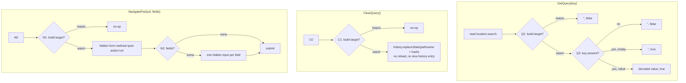

# Location helpers — `GetQuery`, `ClearQuery`, `NavigatePost`

Every diamond has an id; [`docs/PLAN.md`](../PLAN.md) §4 maps each branch to its test.

```mermaid
flowchart TD
    subgraph G["GetQuery(key)"]
        G0[read location.search] --> Q1{Q1: build target?}
        Q1 -- "!wasm" --> GB["'', false"]
        Q1 -- wasm --> Q2{Q2: key present?}
        Q2 -- no --> GN["'', false"]
        Q2 -- "yes, empty" --> GE["'', true"]
        Q2 -- "yes, value" --> GV["decoded value, true"]
    end
    subgraph C["ClearQuery()"]
        C0 --> C1{C1: build target?}
        C1 -- "!wasm" --> CB[no-op]
        C1 -- wasm --> CR["history.replaceState(pathname + hash)<br>no reload, no new history entry"]
    end
    subgraph N["NavigatePost(url, fields)"]
        N0 --> N1{N1: build target?}
        N1 -- "!wasm" --> NB[no-op]
        N1 -- wasm --> NF["hidden form method=post action=url"]
        NF --> N2{N2: fields?}
        N2 -- none --> NS[submit]
        N2 -- some --> NI[one hidden input per field] --> NS
    end
```
